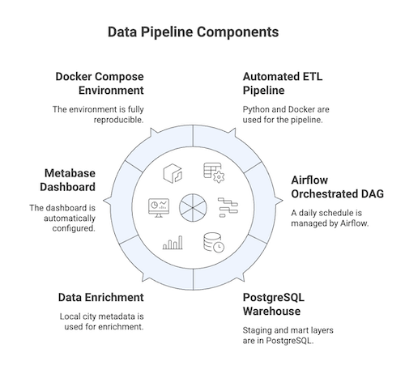

## CHAI Data Engineering, 
Executive Summary Report the Technical Assessment Exercise

Submitted by Emmanuel BAMBANZA

Repo : https://github.com/bambanza/chai_assessment

## 1.  Architecture & Design Overview

The solution is built as a fully containerized data platform, with Docker Compose orchestrating core services: Airflow acts as the pipeline scheduler, coordinating each ETL step; a dedicated Python ETL service handles ingestion, transformation, and data modeling; PostgreSQL is implemented as the central warehouse hosting both staging and mart layers; and Metabase provides instant, no-setup visualization of the processed analytical tables.

The pipeline uses only public, non-sensitive data, including weather information from the Open-Meteo API and a small CSV with city-level attributes. No personal or identifiable data is processed, ensuring full privacy compliance and zero exposure to sensitive information.

### The pipeline follows a clean ETL flow:

* **Ingest:** pull live weather data via API, persist raw CSV
* **Transform:** clean values, standardize types, enrich with a local CSV of city metadata
* **Model:** load into staging_weather, then aggregate into mart_daily_city_weather

**The design mirrors standard CHAI-style pipelines:** raw → curated → analytical tables, all orchestrated through Airflow, with logs, retries, and observability built in by default.

  

## 2. Optimization Choices

* **Idempotent processing:** the mart table is rebuilt each run (TRUNCATE + INSERT) to prevent duplication
* **Separation of concerns:** raw, processed, and warehouse layers kept independent
* **Healthchecks:** PostgreSQL must be ready before Airflow or ETL starts
* **Lightweight storage:** raw and processed CSVs preserved for debugging and reprocessing
* **Clean SQL modeling:** single-pass aggregation using date_trunc
* **Metadata enrichment:** external CSV keeps the pipeline flexible, avoiding hardcoded metrics

These optimizations keep the pipeline stable, fast, and easy to extend.

## 2.  How to scale or extend this pipeline.

The current stack is intentionally simple, but ready to evolve:

    
#### Scaling Options

* Move to KubernetesExecutor or CeleryExecutor for distributed task execution
* Use cloud warehouses like BigQuery/Snowflake for larger datasets
* Store raw/processed data in S3 / GCS / Azure Blob
* Add Prometheus + Grafana for monitoring Airflow and API latency

#### Extensions

* Add more cities, metrics (rainfall, wind, UV), or districts
* Add Great Expectations for data validation
* Add CI/CD (GitHub Actions) for automated testing and deployment
* Use Terraform to fully provision infrastructure and Ansible to manage various tasks.
## 4. AI usage
To speed up the project, different AI tools have been used :

 * Copilot for coding support.
 * Chatgpt for editing documents
 * Napkin.ai for ETL image generation.

## 5. Summary

This assessment delivers a clean, modular, production-style ETL pipeline with: Live API ingestion, Metadata enrichment, Structured transformation, Warehouse modeling, Automated scheduling, Built-in dashboards

